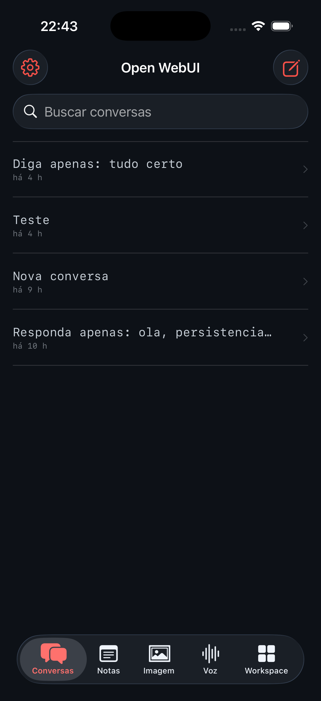
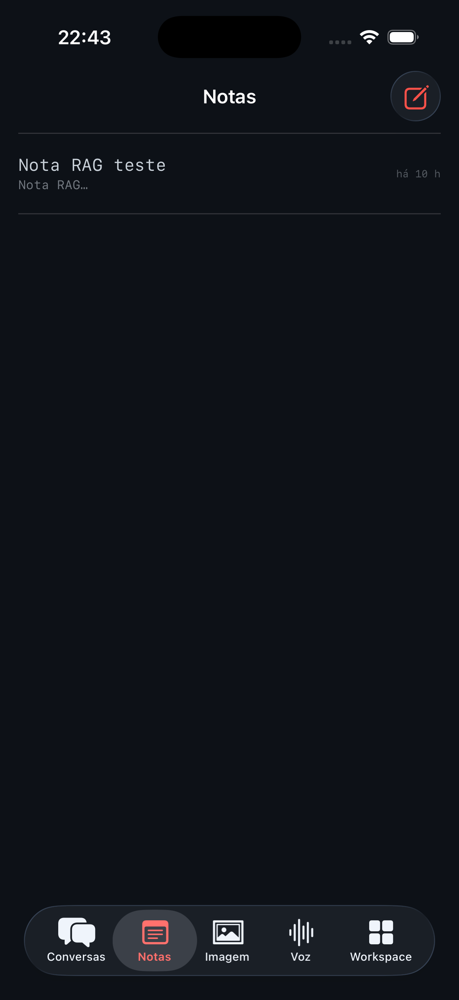
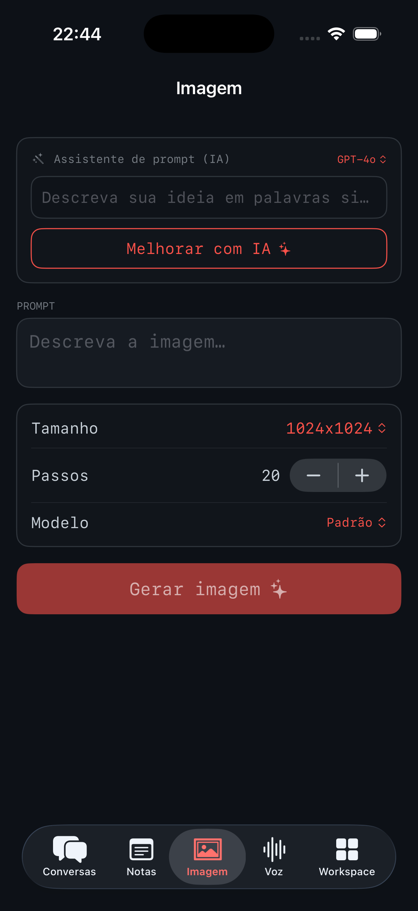
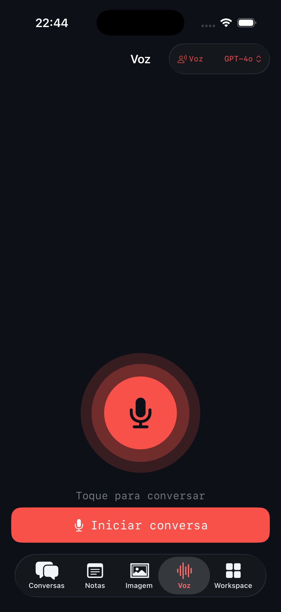
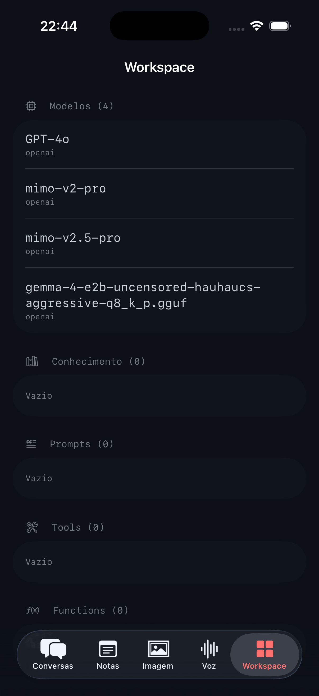

# Open WebUI iOS

<p align="center">
  <a href="https://apps.apple.com/us/app/openwebui-mobile/id6783872393"></a>
</p>

<p align="center">
  <a href="https://apps.apple.com/us/app/openwebui-mobile/id6783872393"></a>
  
  
  <a href="LICENSE"></a>
</p>

> **Available on the App Store:** [OpenWebUI - Mobile](https://apps.apple.com/us/app/openwebui-mobile/id6783872393)
> — free, non-commercial. You still need your own Open WebUI server (see below).
> Now in **34 languages** with automatic device-language detection.

A native **SwiftUI iPhone client** for a self-hosted [Open WebUI](https://github.com/open-webui/open-webui)
instance — built to mirror the web app's day-to-day features in a fast, native shell.
It's also the base app of a two-app project: its core ships as a reusable Swift
package (`OpenWebUIKit`) that a second, voice-first companion app builds on.

> Unofficial client. Not affiliated with or endorsed by Open WebUI.

## Screenshots

<p align="center">
  
  
  
  
  
</p>

<p align="center"><sub>Conversas · Notas · Imagem · Voz · Workspace (Midnight theme)</sub></p>

## Features

- **Chat** with model picker + streaming (OpenAI-compatible SSE), temporary chats,
  and native chat actions (pin, archive, rename, clone, share/unshare, download, delete)
- **Attachments** — photos, camera, documents (RAG), Notes, web pages, knowledge
  bases, and chat references
- **Image generation** (ComfyUI) with size/steps/model + an LLM "prompt helper"
- **Notes** and a read-only **Workspace** (models, knowledge, prompts, tools, functions)
- **Voice mode** — hands-free *listen → think → speak* loop with **barge-in**
  (talk over the reply to interrupt), proximity-based speaker/earpiece routing,
  and per-conversation model + voice. STT and TTS each run on **native iOS**,
  **on-device** (Whisper / PocketTTS neural), or your **server's** engine.
- **Themes** — multi-skin system (Claude, Claude Code, ChatGPT, Codex, Gemini,
  Open WebUI, Hermes + variants, and more) that switches colors, fonts, the app
  icon, and a procedural backdrop.

## Architecture

- **`OpenWebUIKit/`** — a dependency-free (pure Foundation) Swift package wrapping
  the Open WebUI REST + OpenAI-compatible API (auth, models, chats, files, audio,
  images, persistence). Reusable by app #2.
- **`App/`** — the SwiftUI app (iOS 17+). The Xcode project is generated from
  `project.yml` with [XcodeGen](https://github.com/yonaskolb/XcodeGen).

## Build

```sh
./setup.sh                 # installs XcodeGen if needed + generates the project
open OpenWebUI.xcodeproj    # build & run on an iPhone (iOS 17+)
```

`setup.sh` asks for your **Apple Developer Team ID** (needed only for device
builds — press Enter to skip for the simulator), or set it non-interactively:

```sh
DEVELOPMENT_TEAM=ABCDE12345 ./setup.sh
```

Prefer manual? `brew install xcodegen && xcodegen generate`. The default bundle
id is `com.example.openwebui` — change it in `project.yml` if you like. On first
launch, type your Open WebUI server URL in the login screen and sign in.

## License & credits

Licensed under the **PolyForm Noncommercial License 1.0.0** — see [LICENSE](LICENSE).
Third-party projects, models, fonts, and brand-asset notices are in
[THIRD_PARTY_NOTICES.md](THIRD_PARTY_NOTICES.md).
